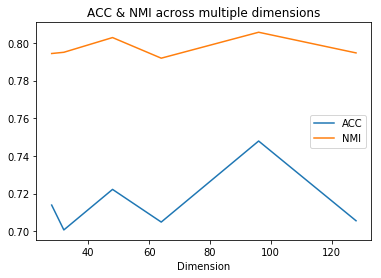

# Deep Embedding Clustering (DEC)

This work is a modified codebase of: https://github.com/XifengGuo/DEC-keras

## What is different?
1. We added a Dockerfile that contains the environment for which this trains and evaluates.
2. We added the ability to train the COIL-20 dataset.
3. We fine-tuned the hyperparameters for the network to obtain the best possible performance on COIL-20 dataset using this network.

## How to train the network?

1. Install Docker with Nvidia GPU support. This could be done following this tutorial: https://github.com/NVIDIA/nvidia-docker
2. Build the docker image using the following snippet:
```
docker build -t dec .
```
3. Open the docker image (i.e. bash into it).
```
docker run --runtime=nvidia --rm -v ./results/:/pretrain-weights -v ./tum-clustering/data/:./data/coil20 dec bash
```
3. Inside the bash, start training the network using the following snippet.
```
KERAS_BACKEND=theano python DEC.py --dataset coil20 --dimension 28
```

## Features Generation

The above script is using a pre-made feature files (i.e. *`.npy` files). These files are numpy arrays that has the following format:
```
features.shape  ==    (1400, DIM * DIM)
labels.shape    ==    (1400, 1)
```

### Ready-to-use Features

If you don't want to use your own features, I created a list of features and labels that you could directly use for training: https://s3-eu-west-1.amazonaws.com/tum-clustering/tum-clustering.zip

1. Download the features
```
curl -OL https://s3-eu-west-1.amazonaws.com/tum-clustering/tum-clustering.zip
```
2. Unzip the folder:
```
unzip tum-clustering.zip
```

Here is a print of the folder structure:
```
tum-clustering
|-- data
|   |-- coil20_features_128.npy
|   |-- coil20_features_28.npy
|   |-- coil20_features_32.npy
|   |-- coil20_features_48.npy
|   |-- coil20_features_64.npy
|   |-- coil20_features_96.npy
|   |-- coil20_labels_128.npy
|   |-- coil20_labels_28.npy
|   |-- coil20_labels_32.npy
|   |-- coil20_labels_48.npy
|   |-- coil20_labels_64.npy
|   `-- coil20_labels_96.npy
`-- pretrain-weights
    |-- ae_weights_coil20_128.h5
    |-- ae_weights_coil20_28.h5
    |-- ae_weights_coil20_32.h5
    |-- ae_weights_coil20_48.h5
    |-- ae_weights_coil20_64.h5
    |-- ae_weights_coil20_96.h5
    `-- ae_weights_mnist_28.h5

2 directories, 19 files
```

## Network fine-tuning



I retrained the DEC network again with different hyperparameter values; yielding in a total of 22 variations of the network on COIL20.

### Important Info:
- Authors did not mention anything about the COIL20 dataset— or how to optimize for it.
- Authors use the same architecture for all datasets they tested against; Only variable/hyperparameter is input size.
- Authors use the same training parameters (number of epochs for training and pre-training), optimizer (Adam), learning rates, and stopping conditions.

### Fine-tuning:
- We trained on the following dimensinos: 28, 32, 48, 64, 96, 128
- We trained the network 3 times per dimension; We choose the best performing accuracy per dimension.
- Default number of epochs is 300 epochs (for pre-training the autoenconder).
Higher number of iterations leads the pre-training to overfit and both ACC & NMI to decrease after 300 epochs.
- The best performing model is using an input size of 96x96 and yields in ACC=0.74792, NMI=0.80572.
- NMI is relatively constant across all dimensions. It varies within 0.02 (between 0.79 and 0.81).
- ACC is very sensitive to different initializations (with same hyperparameters)— that's why I opted to train multipel times per dimensions.
- The original images (i.e. 128x128) yield poor performance when trained on only 300 epochs. When increasing that to a 1000 epochs, it performs much better.
